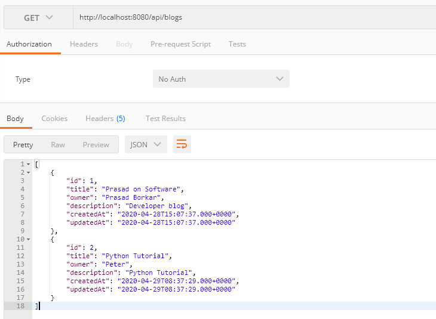
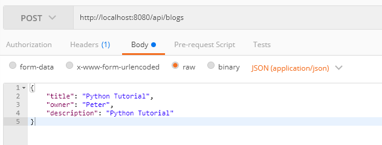
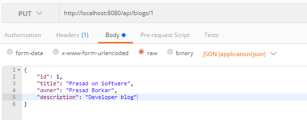
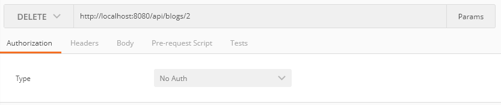

# Blog Management - Spring Boot Application

Blog is a spring-boot application used to maintain bloggers data. Each blog will hold numbers of blog posts posted by the user. This application is created to demonstrate integration of spring-boot application with MySQL database
using ORM Hibernate (Java Persistent API - JPA). 

### Libraries used to build
1. Java 1.8 or above
2. Maven 3.x.x
3. MySQL 8.x.x

### Setup Application

1. Clone or download repository

	`git clone `

2. Create MySQL database
	
	`create database blog`

3. Change spring-boot application properties

	Update `src/main/resources/application.properties` file.
	Change username, password and database name for MySQL database

### Run application
Run below command in your project directory

On windows

	`mvnw spring-boot:run`

On Linux/Posix

	`mvn spring-boot:run`

### Test Application

This application defines below CRUD endpoints:

##### GET /api/blogs

##### POST /api/blogs

##### PUT /api/blogs/{id}

##### DELETE /api/blogs/{id}

